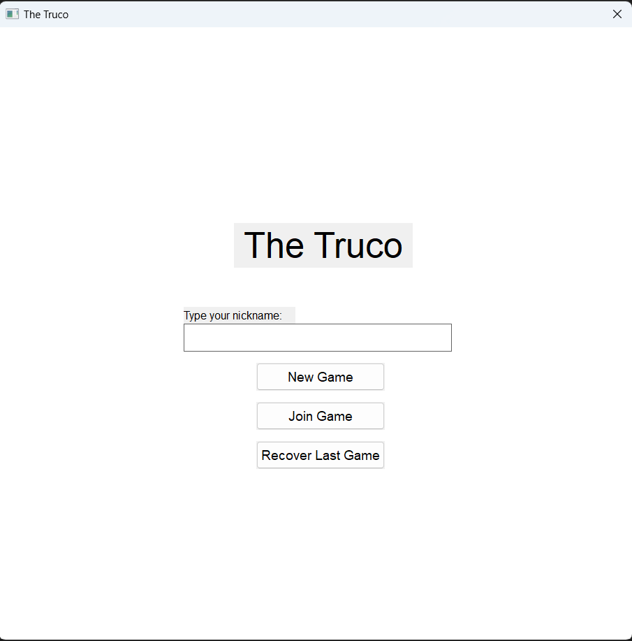
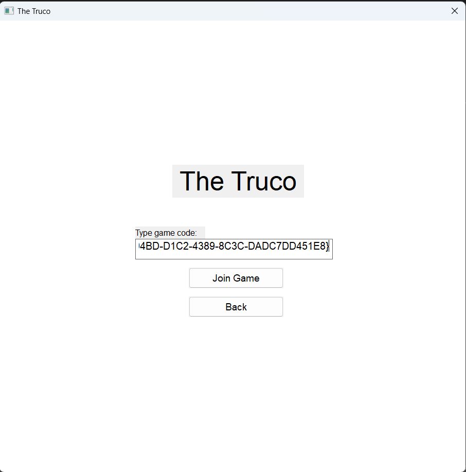
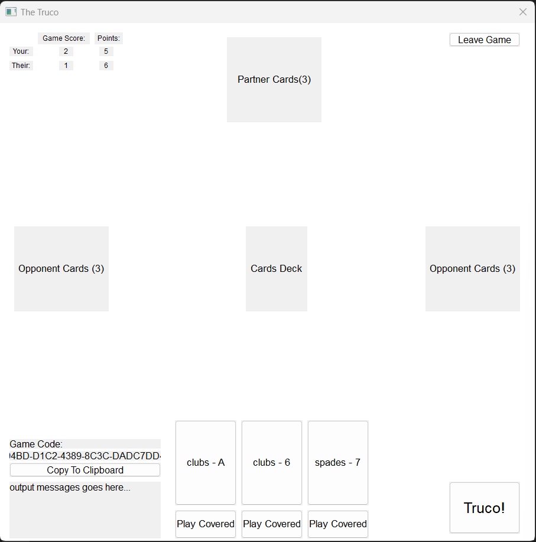
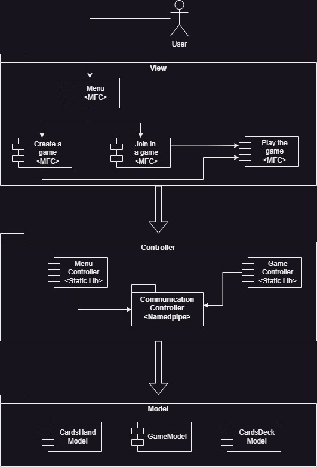
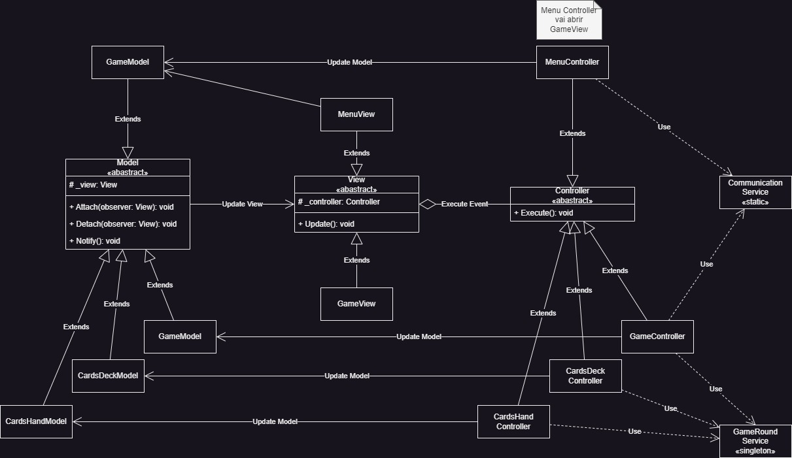
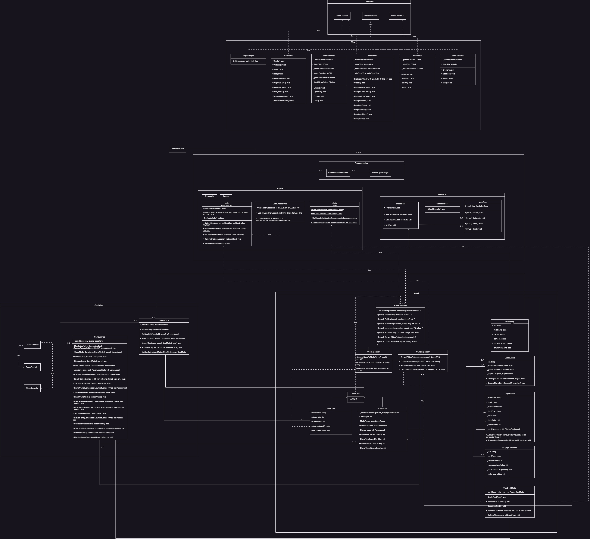
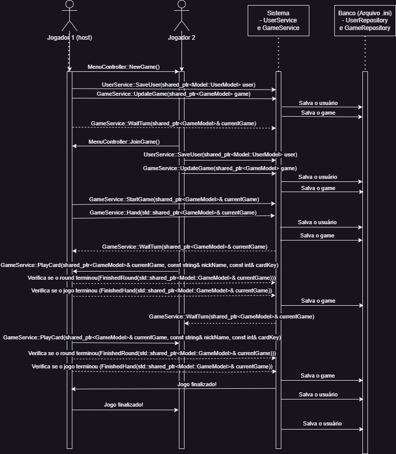

# INF1900 Projeto Final

## Introdução

Repositório do projeto final do curso de C++ da Unicamp.

Alunos:
- Arthur Cesar
- Lucas Arruda
- Marlon Regis
- Roger Luiz

## O Jogo

Foi desenvolvido o jogo **The Truco** seguindo as definições estabelecidas para o projeto final.

A aplicação permite realizar uma partida entre 2 jogadores humanos e 2 *bots*, sendo um jogador responsável por criar a partida e convidar um segundo jogador, através de um código compartilhável.

Uma partida é realizada apenas quando dois jogadores humanos abrem individualmente suas instâncias da aplicação do jogo dentro do mesmo computador e se conectam. O processo para iniciar uma partida depende do jogador 1 deve realizar os seguintes passos:

1. Abrir a aplicação;
2. Inserir um "apelido";
3. Clicar em "New Game";
4. Copiar o *Game Code* gerado no canto inferior esquerdo da tela;
5. Compartilhe o código com o jogador 2;
6. Aguarde o jogador 2 se conectar para iniciar a partida;

Para o jogador os seguintes passos precisam ser seguidos:

1. Abrir a aplicação;
2. Inserir um "apelido" (precisa ser diferente do jogador 1);
3. Clicar em "Join Game";
4. Na tela que abrir insira o *Game Code* compartilhado pelo jogador 1;
5. A partida será iniciada;

A partida é realizada em turnos e apenas o jogador da rodada consegue interagir com a maioria dos controles da tela. Incluindo deixar a partida. Quando um dos jogadores deixa a partida ambas as instâncias são encerradas.

Ainda seria possível recuperar uma partida jogada (não implementado).

# Implementação

O jogo acontece quando as duas instâncias da aplicação se conectam através do IPC da Microsoft Namedpipe. A jogabilidade ocorre dentro de uma tela usando MFC sobre o padrão arquitetural MVC.

Infelizmente não conseguimos completar o jogo totalmente. As funções da partida em si foram implementadas no backend do projeto e a view foi criada, mas não conseguimos finalizar a integração com o controller.

Mesmo não finalizando o jogo foi utilizados diversos conceitos exigidos na descrição do projeto como:

- Classes, Herança, Abstração e Polimorfismo: criado toda a estrutura do MVC com auxílio de abstração e uso de herança sobre as classes bases ViewBase, ControllerBase e ModelBase. Além disso, foi usado o padrão de projeto *observer* - onde foi fundamental o polimorfismo -  para permitir a conexão entre a view e model, visto que o framework MFC não suporta o padrão arquitetural MVC nativamente;
- Encapsulamento: todas as classes estão com atributos encapsulados;
- Multithreading: o fluxo de conexão entre as duas instâncias da aplicação exigiu o uso de threads, semáforos e chamadas *async* (veja MenuController.cpp e GameService.cpp);
- Exceções: o tratamento de exceção foi implementado estava em processo de implementação para exibir possíveis erros em um console na view para informar ao usuário. Não foi concluído o fluxo completamente;
- Interface do Usuário: escrita em MFC é totalmente funcional para os menus, mas parcialmente funcional dentro do game. As cartas são carregas e o controle de turno entre os jogadores também foi implementado;
- Serialização e Persistência: usado a api Win32 para realizar a persistência dos dados e recuperação dos mesmos através de um arquivo *.ini*;
- Smart Pointer: todos os ponteiros utilizam smart pointer;
- Padrão arquitetural: implementado usando MVC;

## Requisitos

O projeto está de acordo com os requisitos definidos [aqui](Doc/Requisitos_TheTruco_ProjetoFinal.pdf).

## Storyboard

A imagem abaixo mostra o fluxo de navegação geral da aplicação.

O usuário pode:

1. Iniciar um novo jogo:
    - A cada jogo será criado um código novo para compartillhar com outro jogador;
    - A partida só iniciará após o segundo jogador se conectar;
2. Entrar em uma partida:
    - O jogador convidado deve utilizar o código do jogo para acessar a partida;
3. Restaurar uma partida interrompida:
    - Apenas para o jogador criador da partida;

## Arquitetura do Projeto

O projeto foi implementado em *C++ 17* utilizando o padrão arquitetural MVC (*Model View Controller*). Para criação da interface de usuário foi utilizado o framework MFC (Microsoft Foundation Class).

Para documentação da arquitetura foi utilizado o *C4 Model*. Todos os diagramas apresentados a seguir estão disponíveis no arquivo *drawio* [aqui](Doc/TheTruco.drawio). 

### Context

A solução consiste em uma aplicação Windows que será executada por cada usuário dentro da mesma máquina. Portanto, cada usuário terá sua instância do jogo e ambos estarão conectados para a mesma partida.

### Container

A aplicação é construída sobre o padrão MVC e tem a disposição um conjunto de interfaces e serviços para delimitar e permitir interações entre as classes e entidades do jogo. Tudo isso está a disposição através de uma biblioteca chamda *Core*.

O *Core* também possí um serviço de comunicação entre processos (*IPC, Inter-Process Communication*) utiliza o recurso de Namedpipe do Windows para trocar mensagens com a instância da aplicação do segundo jogador.

Ainda dentro da biblioteca *Core* uma camada de persistencia abstraí a interação com um banco de dados através de um arquivo *.ini*.

### Component

No diagrama fica claro a separação para o padrão MVC. É mostrado as principais views implementadas, os controles e modelos. Além disso, o principal serviço de comunicação usando para troca de mensagens entre as instâncias.

### Code

Esse foi o diagrama inicial que baseou a implementação do projeto. Fica visível no diagrama que o padrão MVC usa classes abastratas que devem ser implementadas pelas Views, Models e Controllers concretas. Há, ainda, o uso de um *observer* para permitir a atualizção da View de acordo com a model e eventos do controller.

Abaixo segue o diagrama de classe geral da aplicação.

### Principais Fluxos

#### Fluxo Básico do Jogo

#### Conexão Entre Instâncias
