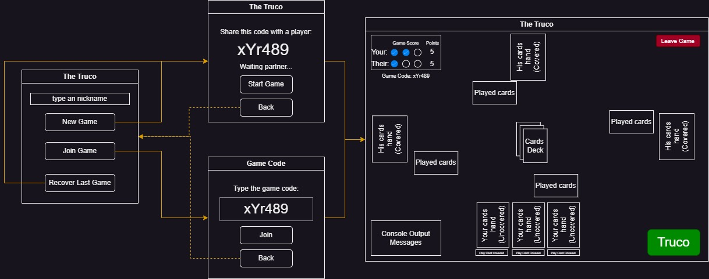
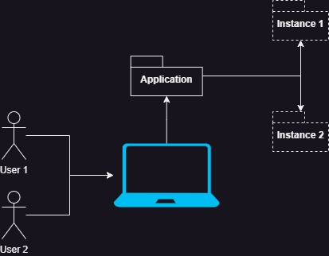
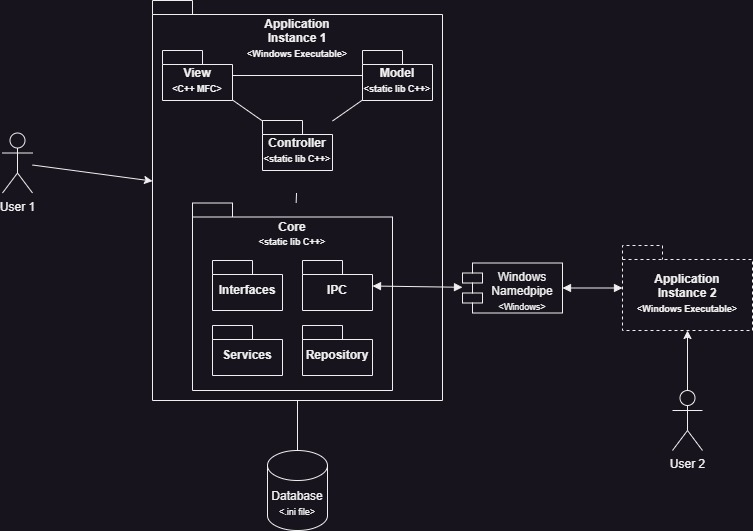

# INF1900 Projeto Final

## Introdução

Repositório do projeto final do curso de C++ da Unicamp.

Alunos:
- Arthur Cesar
- Lucas Arruda
- Marlon Regis
- Roger Luiz

## Requisitos

O projeto está de acordo com os requisitos definidos [aqui](Doc/Requisitos_TheTruco_ProjetoFinal.pdf).

## Storyboard

A imagem abaixo mostra o fluxo de navegação geral da aplicação.

O usuário pode:

1. Iniciar um novo jogo:
    - A cada jogo será criado um código novo para compartillhar com outro jogador;
    - A partida só iniciará após o segundo jogador se conectar;
2. Entrar em uma partida:
    - O jogador convidado deve utilizar o código do jogo para acessar a partida;
3. Restaurar uma partida interrompida:
    - Apenas para o jogador criador da partida;

## Arquitetura do Projeto

O projeto foi implementado em *C++ 17* utilizando o padrão arquitetural MVC (*Model View Controller*). Para criação da interface de usuário foi utilizado o framework MFC (Microsoft Foundation Class).

Para documentação da arquitetura foi utilizado o *C4 Model*. Todos os diagramas apresentados a seguir estão disponíveis no arquivo *drawio* [aqui](Doc/TheTruco.drawio). 

### Context

A solução consiste em uma aplicação Windows que será executada por cada usuário dentro da mesma máquina. Portanto, cada usuário terá sua instância do jogo e ambos estarão conectados para a mesma partida.

### Container

A aplicação é construída sobre o padrão MVC e tem a disposição um conjunto de interfaces e serviços para delimitar e permitir interações entre as classes e entidades do jogo. Tudo isso está a disposição através de uma biblioteca chamda *Core*.

O *Core* também possí um serviço de comunicação entre processos (*IPC, Inter-Process Communication*) utiliza o recurso de Namedpipe do Windows para trocar mensagens com a instância da aplicação do segundo jogador.

Ainda dentro da biblioteca *Core* uma camada de persistencia abstraí a interação com um banco de dados através de um arquivo *.ini*.

### Component

TBD

### Code

TBD

### Principais Fluxos

TBD
